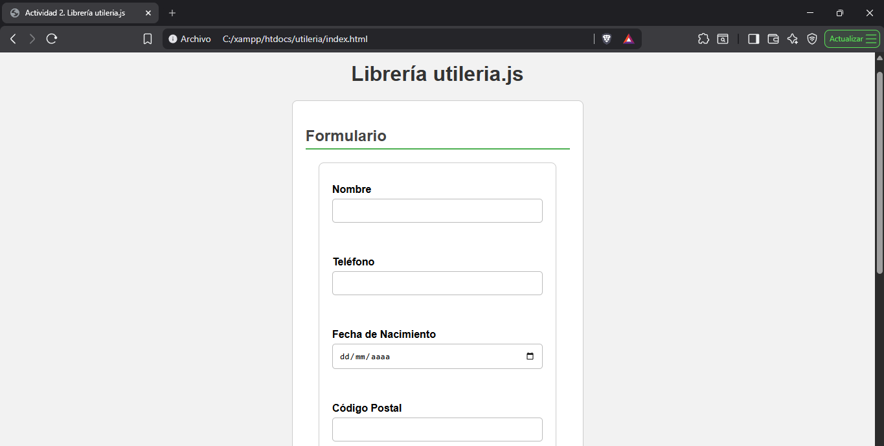
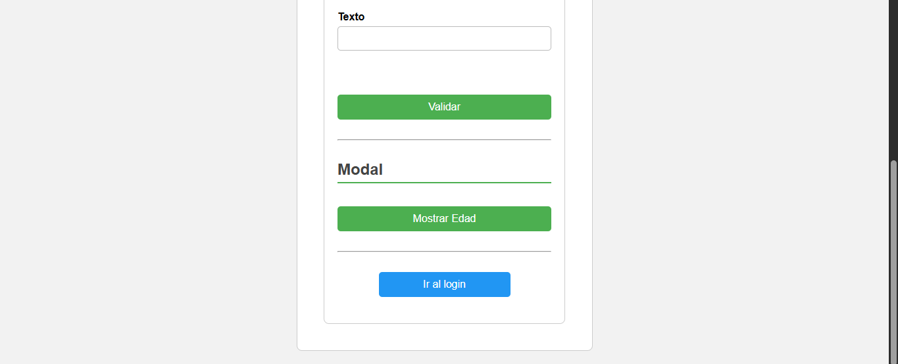
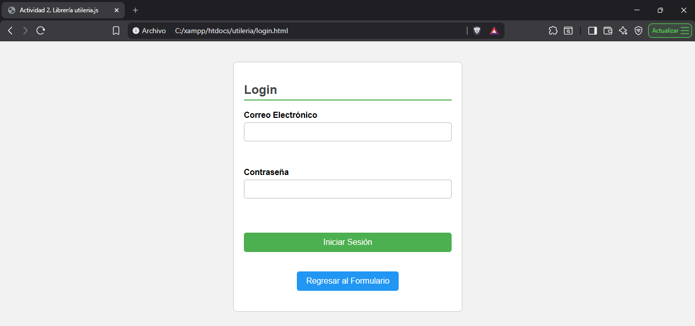
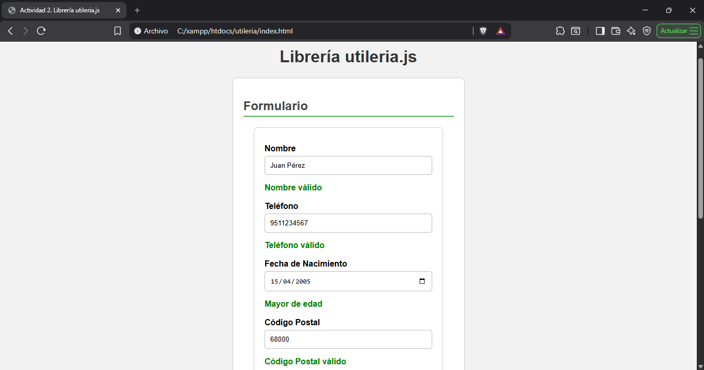
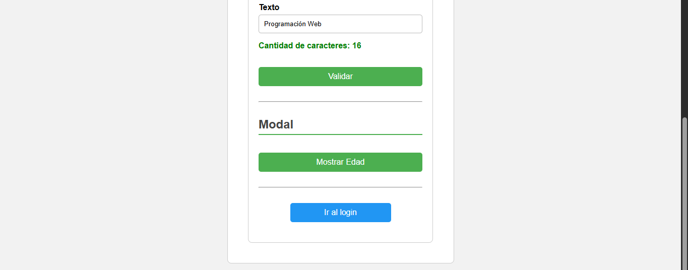
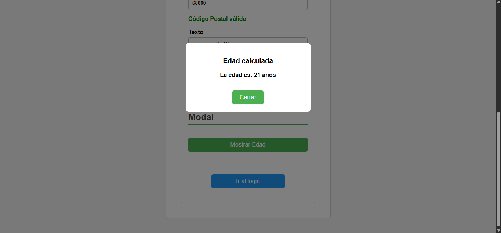
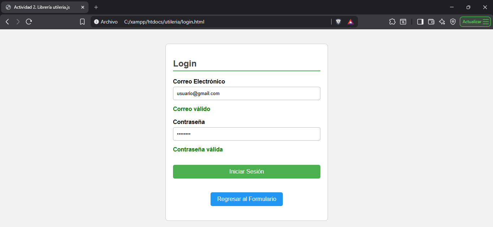
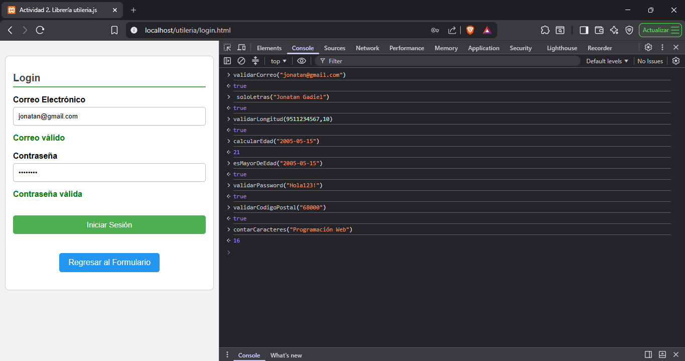

# Actividad 2 - Librería utileria.js

## Autor

**Nombre:** Jonatan (Aquí puedes poner tu nombre completo)

## Descripción

La librería **utileria.js** proporciona un conjunto de funciones en JavaScript para realizar validaciones y cálculos comunes que pueden reutilizarse en diferentes páginas web.

Esta librería tiene funciones para:

- Validar el formato de un correo electrónico.
- Validar que un texto contenga únicamente letras.
- Validar la longitud de un número.
- Calcular la edad a partir de una fecha de nacimiento.
- Verificar si una persona es mayor de edad.
- Validar la seguridad de una contraseña.
- Validar un código postal.
- Contar la cantidad de caracteres de un texto.

---

# Instalación

Para utilizar la librería solo es necesario incluir el archivo `utileria.js` antes de utilizar cualquiera de sus funciones.

```html
<script src="js/utileria.js"></script>
```

---

# Uso

## Validar correo electrónico

```javascript
if(validarCorreo("usuario@gmail.com")){
    console.log("Correo válido");
}else{
    console.log("Correo inválido");
}
```

---

## Validar que un texto solo contenga letras

```javascript
console.log(soloLetras("Juan Pérez"));
```

---

## Validar longitud de un número

```javascript
console.log(validarLongitud(9511234567,10));
```

---

## Calcular edad

```javascript
let edad = calcularEdad("15/04/2005");
console.log(edad);
```

---

## Verificar si es mayor de edad

```javascript
if(esMayorDeEdad("15/04/2005")){
    console.log("Mayor de edad");
}else{
    console.log("Menor de edad");
}
```

---

## Validar contraseña

```javascript
console.log(validarPassword("Hola123!"));
```

---

## Validar código postal

```javascript
console.log(validarCodigoPostal("68000"));
```

---

## Contar caracteres

```javascript
console.log(contarCaracteres("Programación Web"));
```

---

# Capturas de pantalla

## 1. Formulario principal

Vista inicial del formulario (`index.html`) al ingresar a la página.




## 3. Login
Vista inicial del login (`login.html`) al ingresar a la página.


## 4. Formulario con campos rellenados con datos válidos




## 5. Edad calculada y mostrada en Modal


## 6. Login con los campos rellenados con datos válidos


## 7. Pruebas desde la consola


---

# Video demostrativo


---

# Tecnologías utilizadas

- HTML5
- CSS3
- JavaScript